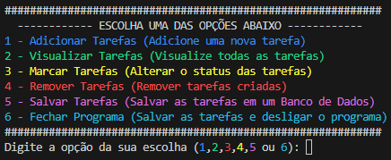

  

<h1 align="center">Gerenciador de Tarefas</h1>

*Graduando em Ciência de Dados na Uninter e Cursando Mestres da Automação*

Este é um projeto de um Gerenciador de Tarefas desenvolvido em Python.

<h2 align="left">Funções do Projeto:</h3>

O projeto está dívidido em 7 principais funções

<h3 align="left">Criar e Conectar ao Banco de Dados:</h3>

Função conecta ao banco tarefas, caso não exista ela cria.

<h3 align="left">Adicionar Novas Tarefas:</h3>

Função usada para criar novas tarefas, a mesma aceita criar um por vez ou passar mais de uma separado por vírgula.

Exemplo: Arrumar a Cama, Estudar Python, Ir a Igreja

<h3 align="left">Visualizar Tarefas:</h3>

Função simples que exibe todas as tarefas criadas até o momento indepente do dia.

<h3 align="left">Alterar Status das Tarefas:</h3>

Função permite ao usuário alterar o status das tarefas que inicialmente começam com Em Andamento. Porém com essa função o usuário pode escolher mudar para Concluído ou Pausado.

<h3 align="left">Remover Tarefas:</h3>

Função permite ao usuário remover uma ou mais tarefas, apenas digitando o nome da tarefa separado por virgula.

Exemplo: Arrumar a Cama, Estudar Python

<h3 align="left">Salvar e Carregar Tarefas:</h3>

Função permite ao usuário salvar todas as tarefas criadas em um banco de dados persistente, ou seja, se no dia seguinte quiser ver as tarefas em andamento é possível.

<h3 align="left">Princial (Main):</h3>

Função que executa as demais funções com base na iteração do usuário com o terminal.

<h3 align="left">Imagem do Menu Principal:</h3>

